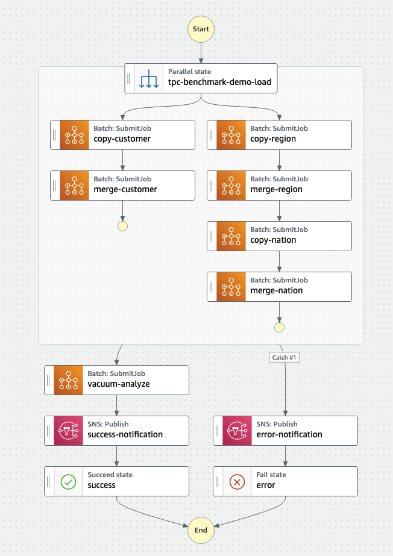
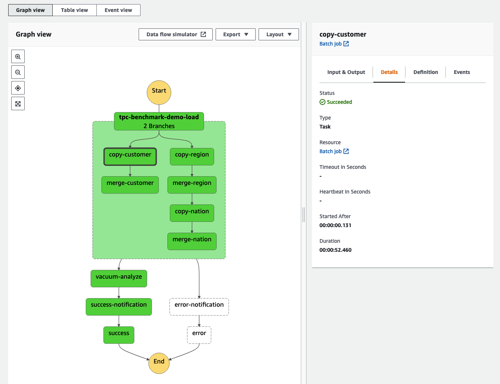

# Amazon Redshift Serverless RSQL ETL Framework

The goal of the Amazon Redshift Serverless RSQL ETL Framework project is to run complex ETL jobs implemented in Amazon Redshift RSQL scripts in the AWS Cloud without having to manage any infrastructure. The solution creates a fully serverless and cost-effective Amazon Redshift ETL orchestration framework. It uses Amazon Redshift RSQL and AWS services such as AWS Batch and AWS Step Functions.

The deployment is fully automated using AWS Cloud Development Kit (AWS CDK) and comprises of the following stacks:

1. `EcrRepositoryStack` - Creates a private Amazon Elastic Container Registry (Amazon ECR) repository that hosts our Docker image with Amazon Redshift RSQL
2. `RsqlDockerImageStack` - Builds our Docker image asset and uploads it to the ECR repository
3. `VpcStack` - Creates a VPC with isolated subnets, creates an Amazon Simple Storage Service (Amazon S3) VPC endpoint gateway, as well as Amazon ECR, Amazon Redshift, and Amazon CloudWatch VPC endpoint interfaces
4. `RedshiftStack` - Creates an Amazon Redshift cluster, enables encryption, enforces encryption in-transit, enables auditing, and deploys the Amazon Redshift cluster in isolated subnets
5. `BatchStack` - Creates a compute environment (using AWS Fargate), job queue, and job definition (using our Docker image with RSQL)
6. `S3Stack` - Creates data, scripts, and logging buckets; enables encryption at-rest; enforces secure transfer; enables object versioning; and disables public access
7. `SnsStack` - Creates an Amazon Simple Notification Service (Amazon SNS) topic and email subscription (email is passed as a parameter)
8. `StepFunctionsStack` - Creates a state machine to orchestrate serverless RSQL ETL jobs
9. `SampleDataDeploymentStack` - Deploys sample RSQL ETL scripts and sample TPC benchmark datasets

The following diagram shows the final architecture.


## Deploy AWS CDK stacks

To deploy the serverless RSQL ETL framework solution, use the following code. Replace `123456789012` with your AWS account number, `eu-west-1` with the AWS Region to which you want deploy the solution, and `your.email@example.com` with your email address to which ETL success and failure notifications are sent.

```
git clone https://github.com/aws-samples/amazon-redshift-serverless-rsql-etl-framework
cd amazon-redshift-serverless-rsql-etl-framework
npm install
./cdk.sh 123456789012 eu-west-1 bootstrap
./cdk.sh 123456789012 eu-west-1 deploy --all --parameters SnsStack:EmailAddressSubscription=your.email@example.com
```

The whole process takes a few minutes. 

## Execute Step Functions state machine

After AWS CDK finishes, a new state machine is created in your account called `ServerlessRSQLETLFramework`. To run it, complete the following steps:

1. Navigate to the Step Functions console.
2. Choose the function to open the details page.
3. Choose **Edit**, and then choose **Workflow Studio New**. The following screenshot shows our state machine.

4. Choose **Cancel** to leave Workflow Studio, then choose **Cancel** again to leave the edit mode. You will be brought back to the details page.
5. Choose **Start execution**. A dialog box appears. By default, the **Name** parameter is set to a random identifier, and the **Input** parameter is set to a sample JSON document.
6. Delete the **Input** parameter and choose **Start execution** to start the state machine.

The Graph view on the details page updates in real time. The state machine starts with a parallel state with two branches. In the left branch, the first job loads customer data into staging table, then in the second job merges new and existing customer records. In the right branch, two smaller tables for regions and nations are loaded and then merged one after another. The parallel state waits until all branches are complete before moving to the vacuum-analyze state, which runs VACUUM and ANALYZE commands on Amazon Redshift. The sample state machine also implements the Amazon SNS Publish API actions to send notifications about success or failure.

From the Graph view, you can check the status of each state by choosing it. Every state that uses an external resource has a link to it on the Details tab. In our example, next to every AWS Batch Job state, you can see a link to the AWS Batch Job details page. Here, you can view the status, runtime, parameters, IAM roles, link to Amazon CloudWatch Logs with the logs produced by ETL scripts, and more.



### Execute Step Functions state machine using AWS CLI

To start the state machine using AWS CLI, use the following code:

```
# fetch the state machine ARN from CloudFormation stack
STATE_MACHINE_ARN=$(aws cloudformation describe-stacks --stack-name StepFunctionsStack --query "Stacks[0].Outputs[?OutputKey=='StateMachineArn'].OutputValue" --output text)
# start the state machine
aws stepfunctions start-execution --state-machine-arn $STATE_MACHINE_ARN
```

## Security

See [CONTRIBUTING](CONTRIBUTING.md#security-issue-notifications) for more information.

## License

This project is licensed under the Apache-2.0 License.
